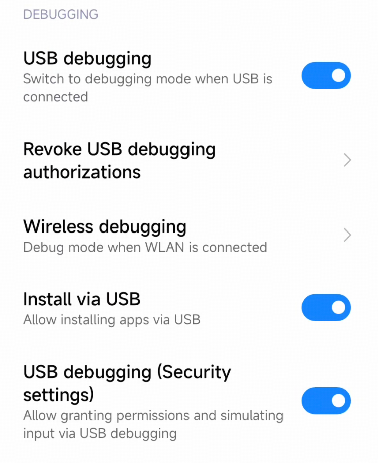
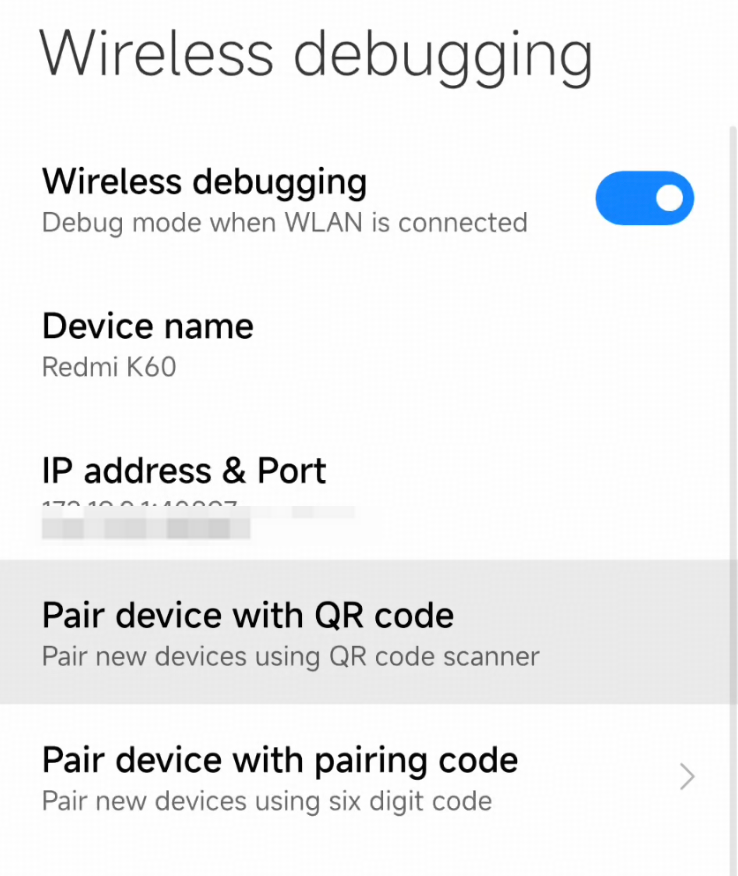

# Open-AutoGLM Quick Start for Coding Agent

<div align="center">

</div>

> **本文专为 AI 助手（如 Claude Code）阅读，用于自动化部署 Open-AutoGLM。**
>
> **This document is designed for AI assistants (such as Claude Code) to automate the deployment of Open-AutoGLM.**
>
> 如果你是人类读者，可以跳过本文，按照 README.md 文档操作即可。
>
> If you are a human reader, you can skip this document and follow the README.md instructions instead.

---

## Table of Contents / 目录

- [English](#english)
- [中文](#中文)

---

# English

## Prerequisites

### 1. Python Environment

Python 3.10 or higher is required.

### 2. ADB (Android Debug Bridge)

1. Download the official ADB [installation package](https://developer.android.com/tools/releases/platform-tools)
2. Extract and configure environment variables:

**macOS:**

```bash
# Assuming extracted to ~/Downloads/platform-tools
export PATH=${PATH}:~/Downloads/platform-tools
```

**Windows:** Add the extracted folder path to your system PATH. Refer to [this tutorial](https://blog.csdn.net/x2584179909/article/details/108319973) if needed.

### 3. Android Device Setup

Requirements:
- Android 7.0+ device or emulator
- Developer Mode enabled
- USB Debugging enabled

**Enable Developer Mode:**
1. Go to `Settings > About Phone > Build Number`
2. Tap rapidly about 10 times until "Developer mode enabled" appears

**Enable USB Debugging:**
1. Go to `Settings > Developer Options > USB Debugging`
2. Enable the toggle
3. Some devices may require a restart

**Important permissions to check:**



### 4. Install ADB Keyboard

Download and install [ADB Keyboard APK](https://github.com/senzhk/ADBKeyBoard/blob/master/ADBKeyboard.apk) on your device.

After installation, enable it in `Settings > Input Method` or `Settings > Keyboard List`.

---

## Installation

```bash
# Install dependencies
pip install -r requirements.txt

# Install package
pip install -e .
```

---

## ADB Configuration

**Ensure your USB cable supports data transfer (not charging only).**

### Verify Connection

```bash
# Check connected devices
adb devices

# Expected output:
# List of devices attached
# emulator-5554   device
```

### Remote Debugging (WiFi)

Ensure your phone and computer are on the same WiFi network.



```bash
# Connect via WiFi (replace with your phone's IP and port)
adb connect 192.168.1.100:5555

# Verify connection
adb devices
```

### Device Management

```bash
# List all devices
adb devices

# Connect remote device
adb connect <ip>:<port>

# Disconnect device
adb disconnect <ip>:<port>
```

---

## Usage

### Command Line

```bash
# Interactive mode
python main.py --base-url <MODEL_API_URL> --model <MODEL_NAME>

# Execute specific task
python main.py --base-url <MODEL_API_URL> "Open Chrome browser"

# Use API key authentication
python main.py --apikey sk-xxxxx

# English system prompt
python main.py --lang en --base-url <MODEL_API_URL> "Open Chrome browser"

# List supported apps
python main.py --list-apps

# Specify device
python main.py --device-id 192.168.1.100:5555 --base-url <MODEL_API_URL> "Open TikTok"
```

### Python API

```python
from phone_agent import PhoneAgent
from phone_agent.model import ModelConfig

# Configure model
model_config = ModelConfig(
    base_url="<MODEL_API_URL>",
    model_name="<MODEL_NAME>",
)

# Create Agent
agent = PhoneAgent(model_config=model_config)

# Execute task
result = agent.run("Open eBay and search for wireless earbuds")
print(result)
```

---

## Environment Variables

| Variable                  | Description               | Default                      |
|---------------------------|---------------------------|------------------------------|
| `PHONE_AGENT_BASE_URL`    | Model API URL             | `http://localhost:8000/v1`   |
| `PHONE_AGENT_MODEL`       | Model name                | `autoglm-phone-9b`           |
| `PHONE_AGENT_API_KEY`     | API key                   | `EMPTY`                      |
| `PHONE_AGENT_MAX_STEPS`   | Max steps per task        | `100`                        |
| `PHONE_AGENT_DEVICE_ID`   | ADB device ID             | (auto-detect)                |
| `PHONE_AGENT_LANG`        | Language (`cn`/`en`)      | `cn`                         |

---

## Troubleshooting

### Device Not Found

```bash
adb kill-server
adb start-server
adb devices
```

Check:
1. USB debugging enabled
2. USB cable supports data transfer
3. Authorization popup approved on phone
4. Try different USB port/cable

### Can Open Apps but Cannot Tap

Enable both in `Settings > Developer Options`:
- **USB Debugging**
- **USB Debugging (Security Settings)**

### Text Input Not Working

1. Ensure ADB Keyboard is installed
2. Enable in `Settings > System > Language & Input > Virtual Keyboard`

### Windows Encoding Issues

Add environment variable before running:

```bash
PYTHONIOENCODING=utf-8 python main.py ...
```

---

# 中文

## 环境要求

### 1. Python 环境

需要 Python 3.10 及以上版本。

### 2. ADB (Android Debug Bridge)

1. 下载官方 ADB [安装包](https://developer.android.com/tools/releases/platform-tools?hl=zh-cn)
2. 解压并配置环境变量：

**macOS:**

```bash
# 假设解压到 ~/Downloads/platform-tools
export PATH=${PATH}:~/Downloads/platform-tools
```

**Windows:** 将解压后的文件夹路径添加到系统 PATH。可参考[此教程](https://blog.csdn.net/x2584179909/article/details/108319973)。

### 3. 安卓设备配置

要求：
- Android 7.0+ 设备或模拟器
- 开发者模式已启用
- USB 调试已启用

**启用开发者模式：**
1. 进入 `设置 > 关于手机 > 版本号`
2. 连续快速点击约 10 次，直到提示"开发者模式已启用"

**启用 USB 调试：**
1. 进入 `设置 > 开发者选项 > USB 调试`
2. 开启开关
3. 部分设备可能需要重启

**请务必检查以下权限：**


### 4. 安装 ADB Keyboard

在设备上下载并安装 [ADB Keyboard APK](https://github.com/senzhk/ADBKeyBoard/blob/master/ADBKeyboard.apk)。

安装后，在 `设置 > 输入法` 或 `设置 > 键盘列表` 中启用。

---

## 安装

```bash
# 安装依赖
pip install -r requirements.txt

# 安装包
pip install -e .
```

---

## ADB 配置

**请确保 USB 数据线支持数据传输（而非仅充电）。**

### 验证连接

```bash
# 检查已连接设备
adb devices

# 预期输出：
# List of devices attached
# emulator-5554   device
```

### 远程调试（WiFi）

确保手机和电脑在同一 WiFi 网络中。


```bash
# 通过 WiFi 连接（替换为手机显示的 IP 和端口）
adb connect 192.168.1.100:5555

# 验证连接
adb devices
```

### 设备管理

```bash
# 列出所有设备
adb devices

# 连接远程设备
adb connect <ip>:<port>

# 断开设备
adb disconnect <ip>:<port>
```

---

## 使用方法

### 命令行

```bash
# 交互模式
python main.py --base-url <模型API地址> --model <模型名称>

# 执行指定任务
python main.py --base-url <模型API地址> "打开美团搜索附近的火锅店"

# 使用 API Key 认证
python main.py --apikey sk-xxxxx

# 使用英文系统提示词
python main.py --lang en --base-url <模型API地址> "Open Chrome browser"

# 列出支持的应用
python main.py --list-apps

# 指定设备
python main.py --device-id 192.168.1.100:5555 --base-url <模型API地址> "打开抖音刷视频"
```

### Python API

```python
from phone_agent import PhoneAgent
from phone_agent.model import ModelConfig

# 配置模型
model_config = ModelConfig(
    base_url="<模型API地址>",
    model_name="<模型名称>",
)

# 创建 Agent
agent = PhoneAgent(model_config=model_config)

# 执行任务
result = agent.run("打开淘宝搜索无线耳机")
print(result)
```

---

## 环境变量

| 变量                        | 描述               | 默认值                        |
|---------------------------|------------------|----------------------------|
| `PHONE_AGENT_BASE_URL`    | 模型 API 地址        | `http://localhost:8000/v1` |
| `PHONE_AGENT_MODEL`       | 模型名称             | `autoglm-phone-9b`         |
| `PHONE_AGENT_API_KEY`     | API Key          | `EMPTY`                    |
| `PHONE_AGENT_MAX_STEPS`   | 每个任务最大步数         | `100`                      |
| `PHONE_AGENT_DEVICE_ID`   | ADB 设备 ID        | (自动检测)                     |
| `PHONE_AGENT_LANG`        | 语言 (`cn`/`en`)   | `cn`                       |

---

## 常见问题

### 设备未找到

```bash
adb kill-server
adb start-server
adb devices
```

检查：
1. USB 调试是否已开启
2. 数据线是否支持数据传输
3. 手机上的授权弹窗是否已点击「允许」
4. 尝试更换 USB 接口或数据线

### 能打开应用但无法点击

在 `设置 > 开发者选项` 中同时启用：
- **USB 调试**
- **USB 调试（安全设置）**

### 文本输入不工作

1. 确保已安装 ADB Keyboard
2. 在 `设置 > 系统 > 语言和输入法 > 虚拟键盘` 中启用

### Windows 编码异常

运行代码前添加环境变量：

```bash
PYTHONIOENCODING=utf-8 python main.py ...
```

---

## License

This project is for research and learning purposes only. See [Terms of Use](resources/privacy_policy.txt) / [使用条款](resources/privacy_policy.txt).
