本文记录了我尝试部署Open-AutoGLM的过程

PC环境：

版本  Windows 11 家庭版
版本号 25H2
安装日期    ‎2025/‎3/‎24
操作系统版本  26200.7171
体验  Windows 功能体验包 1000.26100.265.0

## 环境搭建部分

首先我使用git clone命令将仓库克隆到本地

```
git clone git@github.com:ma-jiale/Open-AutoGLM.git
```

使用conda创建一个python虚拟环境

```
conda create -n phone-agent python=3.11
```

激活虚拟环境并按照requirements.txt和setup.py安装依赖包

```
conda activate phone-agent
ip install -r requirements.txt 
pip install -e .
```

根据README.md可知我们还需要安装ADB (Android Debug Bridge)，安装步骤如下：

1. 下载官方 ADB [安装包](https://developer.android.com/tools/releases/platform-tools?hl=zh-cn)，并解压到自定义路径
2. 配置环境变量（很重要，如果不知道如何配置可以百度）

- MacOS 配置方法：在 `Terminal` 或者任何命令行工具里

  ```bash
  # 假设解压后的目录为 ~/Downlaods/platform-tools。如果不是请自行调整命令。
  export PATH=${PATH}:~/Downloads/platform-tools
  ```

- Windows 配置方法：可参考 [第三方教程](https://blog.csdn.net/x2584179909/article/details/108319973) 进行配置。当在CMD中输入adb，看到如下输出时，说明ADB安装完成

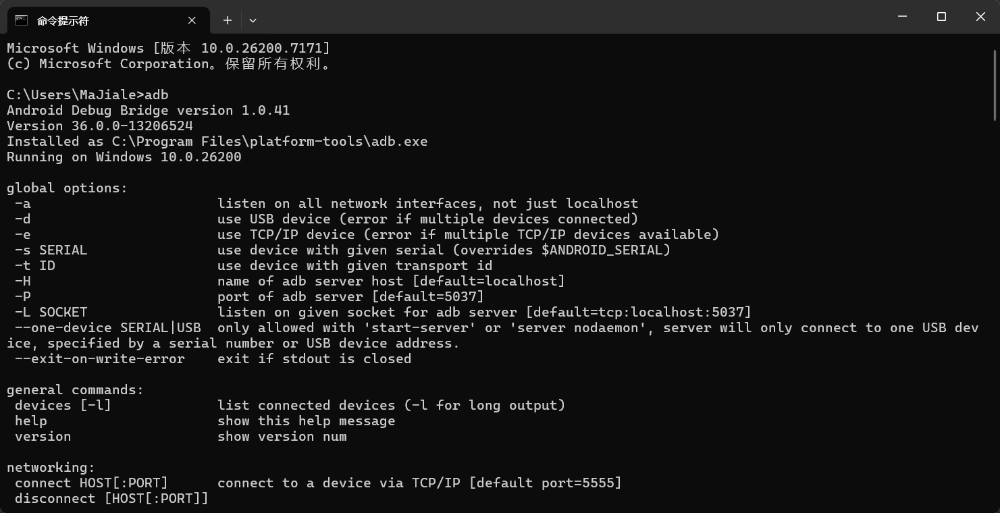

接下来准备一块系统版本号大于7.0的安卓手机，打开它的开发者模式中的USB调试开关，用一根数据线连接手机和PC, 然后在CMD中输入`adb devices`, 可以看到连接的设备的简要信息，这表明连接成功

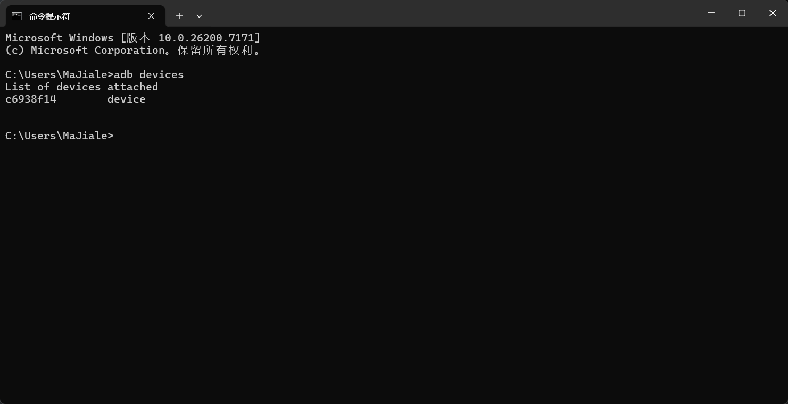

接下来在手机上安装ADB Keyboard用于程序自动输入文本

下载 [安装包](https://github.com/senzhk/ADBKeyBoard/blob/master/ADBKeyboard.apk) 并在对应的安卓设备中进行安装。
注意，安装完成后还需要到 `设置-输入法` 或者 `设置-键盘列表` 中启用 `ADB Keyboard` 才能生效

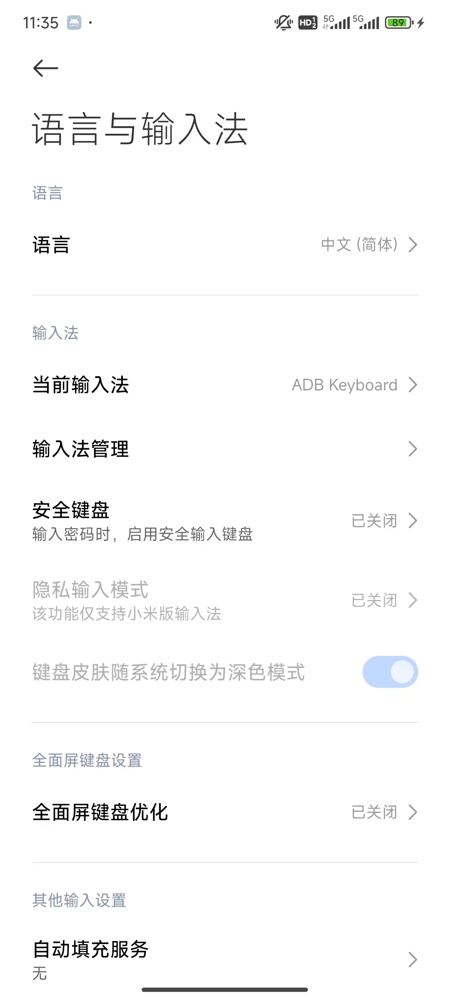

## 启动模型服务部分

使用下面的命令下载模型：

```
pip install modelscope
modelscope download --model ZhipuAI/AutoGLM-Phone-9B
```

README.md中提供一个 vLLM部署方案，所以我决定使用vLLM来部署模型

因为我的PC搭载的是Window系统。而vLLM 官方主要支持 Linux；在原生 Windows 上跑 vLLM 较困难。根据AI的回答，我觉得使用vLLM的Docker容器来部署模型，这样可以通过本机 WSL2 + GPU 直通的方式，发挥显卡的最大性能

首先确保Docker可以识别英伟达独立显卡，因为显然用CPU跑大模型比较困难的（此时我也高估了我的RTX 4060）

```
docker run --rm --gpus all nvidia/cuda:12.1.1-base-ubuntu22.04 nvidia-smi
```

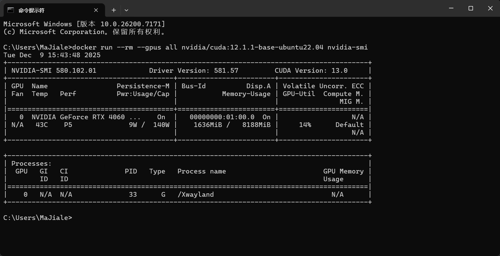

可以看到Docker可以识别英伟达独立显卡

接着安装vLLM镜像

使用`Docker Desktop`安装最新vLLM的Docker镜像

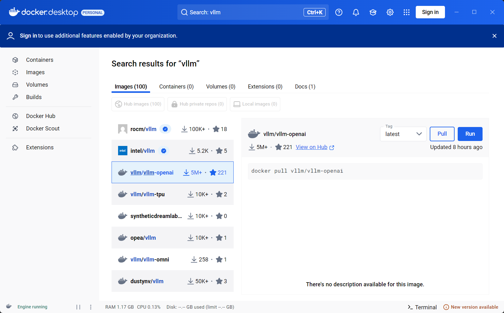

运行下面的命令检查vLLM容器能否识别显卡

```
docker run --rm -it --gpus all vllm/vllm-openai:latest python3 -c "import torch; print('CUDA:', torch.cuda.is_available()); print('GPU:', torch.cuda.get_device_name(0))"
```

使用vllm-openai Docker镜像启动模型服务命令

```
docker run --rm -it --gpus all -p 8000:8000 ^
  --shm-size=16g ^
  -v D:\Repos\cloned\Open-AutoGLM\AutoGLM-Phone-9B:/model ^
  --entrypoint python3 vllm/vllm-openai:latest ^
  -m vllm.entrypoints.openai.api_server ^
  --served-model-name autoglm-phone-9b ^
  --allowed-local-media-path / ^
  --mm-encoder-tp-mode data ^
  --mm_processor_cache_type shm ^
  --mm_processor_kwargs "{\"max_pixels\":5000000}" ^
  --max-model-len 25480 ^
  --chat-template-content-format string ^
  --limit-mm-per-prompt "{\"image\":10}" ^
  --model /model ^
  --port 8000
```

但是因为我的PC的显卡（RTX4060）只有8g显存，启动模型服务会因为OOM(Out of Memory)失败，多次尝试调整参数无解

所以我接下来考虑使用有高性能显卡的云服务器来部署模型服务

我在浏览器上搜索了一下，发现了一个名为AutoDL AI算力云的算力服务平台：https://www.autodl.com/

注册账号后，在容器实例界面选择租用新实例

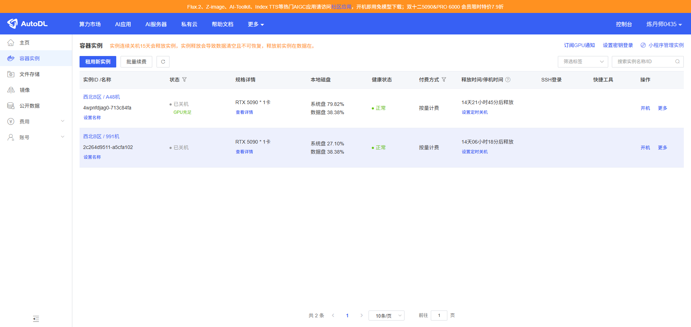

刚好RTX5090在打折，我选择的配置如下：

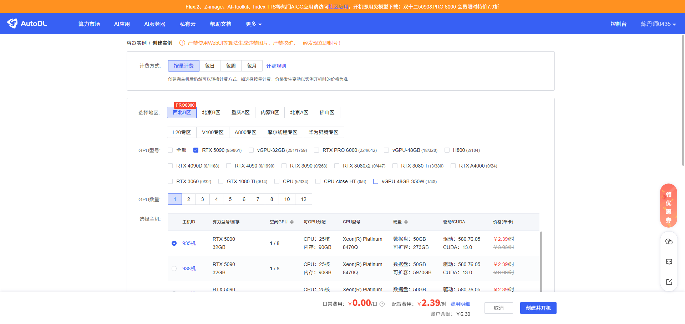

选好配置后点击`创建并开机`，然后先关机，在点击`更多`中的`无卡模型开机`,因为无卡模式下一个小时的租金只有0.1元，我们可以在无卡模式配好环境，下载好模型后，再正常开机启动模型服务

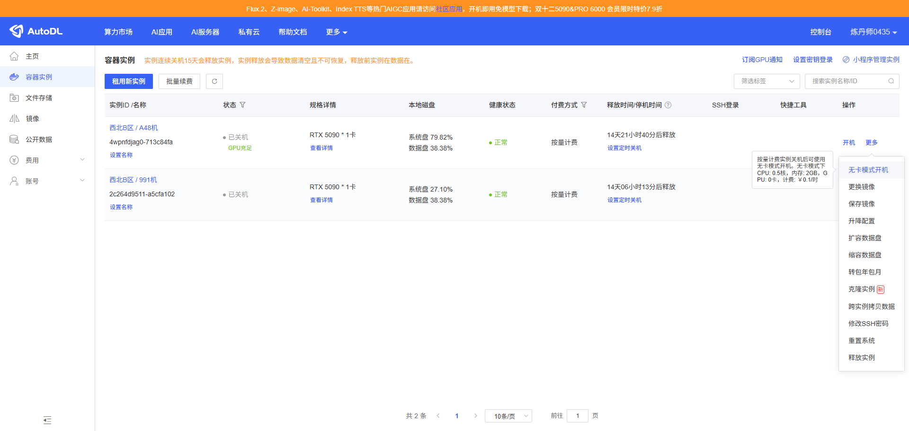

配置环境和下载模型部分与前述相同，这里不再赘述

配置好python环境后，使用pip命令安装vLLM

```
pip install vllm
```

运行模型

```
python3 -m vllm.entrypoints.openai.api_server \
  --served-model-name autoglm-phone-9b \
  --allowed-local-media-path / \
  --mm-encoder-tp-mode data \
  --mm_processor_cache_type shm \
  --mm_processor_kwargs "{\"max_pixels\":5000000}" \
  --max-model-len 25480 \
  --chat-template-content-format string \
  --limit-mm-per-prompt "{\"image\":10}" \
  --model /root/autodl-tmp/auto_GLM/ZhipuAI/AutoGLM-Phone-9B \
  --port 6006
```

当模型正常启动后，因为我们需要使用AutoDL这个平台提供的一个SSH隧道工具将实例的端口代理到本地

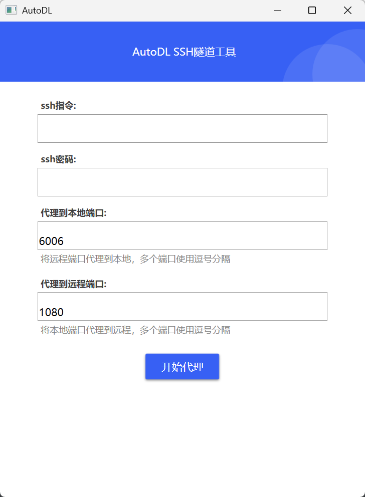

填入使用的容器实例的SSH登录指令和密码

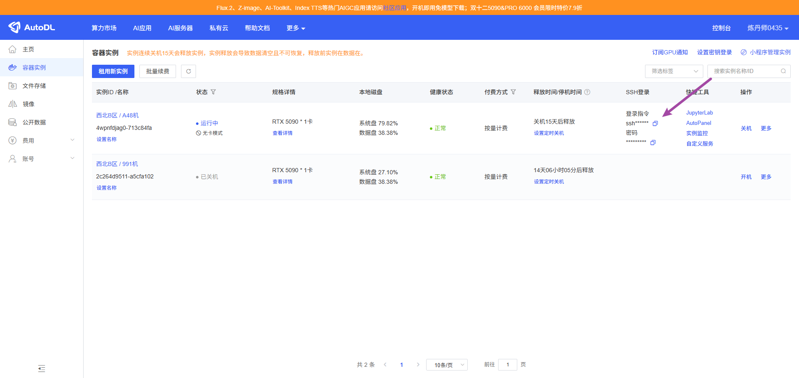

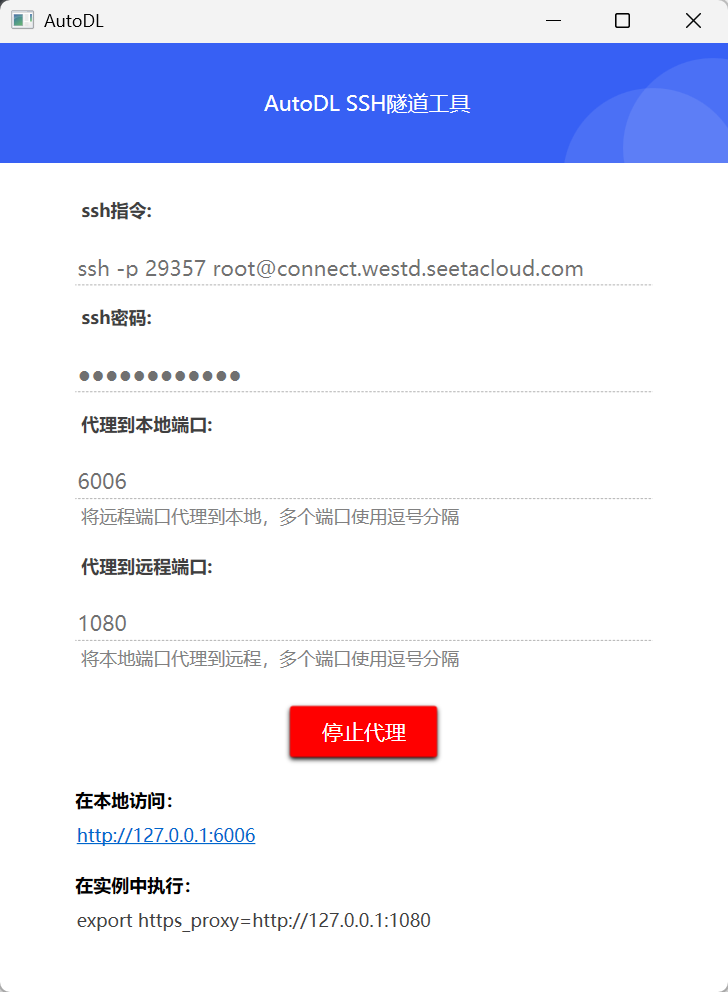

这样我们就可以通过http://127.0.0.1:6006访问模型服务了,注意这里的端口号6006需要与模型启动时设置的端口号一致

## 测试

在连接好手机后，接下来我在我的PC上交互式运行Open auto-GLM

```
python main.py --base-url http://127.0.0.1:6006/v1 --model "autoglm-phone-9b"
```

可以看到程序已经正常运行

输入指令如：打开小红书给数字生命卡兹克的第一个帖子点赞并关注他

我发现程序一直输出当前屏幕是隐私屏幕或者黑屏，无法操作。

经过测试发现虽然使用adb命令可以正确截图，但是程序的screenshot.py脚本中的get_screenshot方法无法返回正确的屏幕截图，ai猜测可能是该方法中使用adb命令截图后需要保存在手机的/sdcard目录下，再拉取到PC内存中的步骤因缺少权限失败，所以我修改了get_screenshot, 直接使用adb命令从stdout中读取截图

```
def get_screenshot(device_id: str | None = None, timeout: int = 10) -> Screenshot:
    """
    Capture a screenshot from the connected Android device.

    Args:
        device_id: Optional ADB device ID for multi-device setups.
        timeout: Timeout in seconds for screenshot operations.

    Returns:
        Screenshot object containing base64 data and dimensions.

    Note:
        If the screenshot fails (e.g., on sensitive screens like payment pages),
        a black fallback image is returned with is_sensitive=True.
    """
    adb_prefix = _get_adb_prefix(device_id)

    try:
        # Read PNG from stdout directly to avoid reading /sdcard fail
        result = subprocess.run(
            adb_prefix + ["exec-out", "screencap", "-p"],
            capture_output=True,
            timeout=timeout,
        )

        if result.returncode != 0 or not result.stdout:
            return _create_fallback_screenshot(is_sensitive=False)

        # Read and encode image
        img = Image.open(BytesIO(result.stdout))
        width, height = img.size

        buffered = BytesIO()
        img.save(buffered, format="PNG")
        base64_data = base64.b64encode(buffered.getvalue()).decode("utf-8")

        return Screenshot(
            base64_data=base64_data, width=width, height=height, is_sensitive=False
        )

    except Exception as e:
        print(f"Screenshot error: {e}")
        return _create_fallback_screenshot(is_sensitive=False)
```

重新运行程序后，auto-GLM可以完美完成任务
