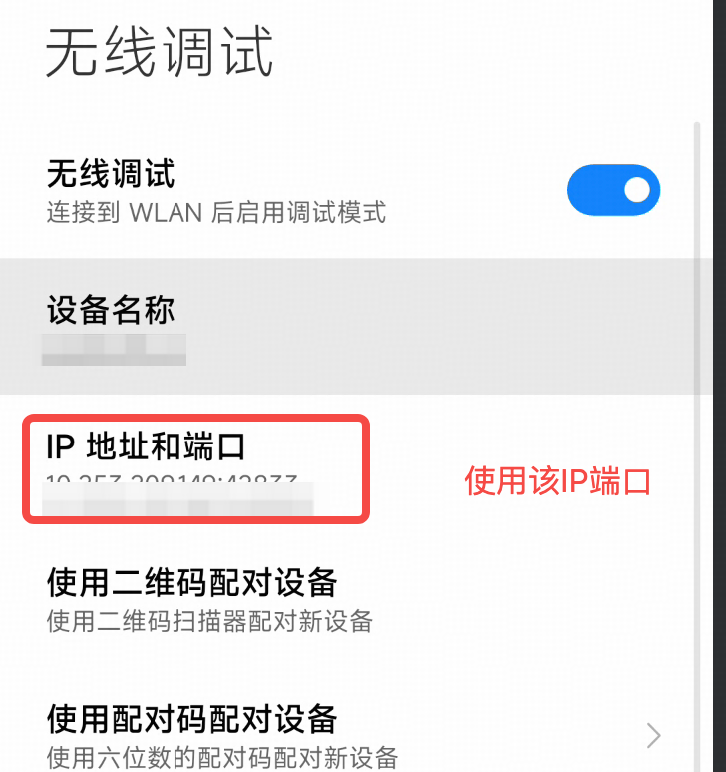

# 远程控制指南

Phone Agent 支持通过 WiFi/网络进行远程 ADB/HDC 调试，无需 USB 连接即可控制设备。

## 配置远程调试

### 在手机端开启无线调试

#### Android 设备

确保手机和电脑在同一个 WiFi 中，如图所示



#### 鸿蒙设备

确保手机和电脑在同一个 WiFi 中：

1. 进入 `设置 > 系统和更新 > 开发者选项`
2. 开启 `USB 调试` 和 `无线调试`
3. 记录显示的 IP 地址和端口号

### 在电脑端使用标准 ADB/HDC 命令

```bash
# Android 设备 - 通过 WiFi 连接, 改成手机显示的 IP 地址和端口
adb connect 192.168.1.100:5555

# 验证连接
adb devices
# 应显示：192.168.1.100:5555    device

# 鸿蒙设备 - 通过 WiFi 连接
hdc tconn 192.168.1.100:5555

# 验证连接
hdc list targets
# 应显示：192.168.1.100:5555
```

## 设备管理命令

### Android 设备（ADB）

```bash
# 列出所有已连接设备
adb devices

# 连接远程设备
adb connect 192.168.1.100:5555

# 断开指定设备
adb disconnect 192.168.1.100:5555

# 指定设备执行任务
python main.py --device-id 192.168.1.100:5555 --base-url http://localhost:8000/v1 --model "autoglm-phone-9b" "打开抖音刷视频"
```

### 鸿蒙设备（HDC）

```bash
# 列出所有已连接设备
hdc list targets

# 连接远程设备
hdc tconn 192.168.1.100:5555

# 断开指定设备
hdc tdisconn 192.168.1.100:5555

# 指定设备执行任务
python main.py --device-type hdc --device-id 192.168.1.100:5555 --base-url http://localhost:8000/v1 --model "autoglm-phone-9b" "打开抖音刷视频"
```

## Python API 远程连接

### 连接 Android 设备（ADB）

```python
from phone_agent.adb import ADBConnection, list_devices

# 创建连接管理器
conn = ADBConnection()

# 连接远程设备
success, message = conn.connect("192.168.1.100:5555")
print(f"连接状态：{message}")

# 列出已连接设备
devices = list_devices()
for device in devices:
    print(f"{device.device_id} - {device.connection_type.value}")

# 在 USB 设备上启用 TCP/IP
success, message = conn.enable_tcpip(5555)
ip = conn.get_device_ip()
print(f"设备 IP: {ip}")

# 断开连接
conn.disconnect("192.168.1.100:5555")
```

### 连接鸿蒙设备（HDC）

```python
from phone_agent.hdc import HDCConnection, list_devices

# 创建连接管理器
conn = HDCConnection()

# 连接远程设备
success, message = conn.connect("192.168.1.100:5555")
print(f"连接状态：{message}")

# 列出已连接设备
devices = list_devices()
for device in devices:
    print(f"{device.device_id} - {device.connection_type.value}")

# 断开连接
conn.disconnect("192.168.1.100:5555")
```

## 远程连接问题排查

### 连接被拒绝

- 确保设备和电脑在同一网络
- 检查防火墙是否阻止 5555 端口
- 确认已启用 TCP/IP 模式：`adb tcpip 5555`

### 连接断开

- WiFi 可能断开了，使用 `--connect` 重新连接
- 部分设备重启后会禁用 TCP/IP，需要通过 USB 重新启用

### 多设备

- 使用 `--device-id` 指定要使用的设备
- 或使用 `--list-devices` 查看所有已连接设备
